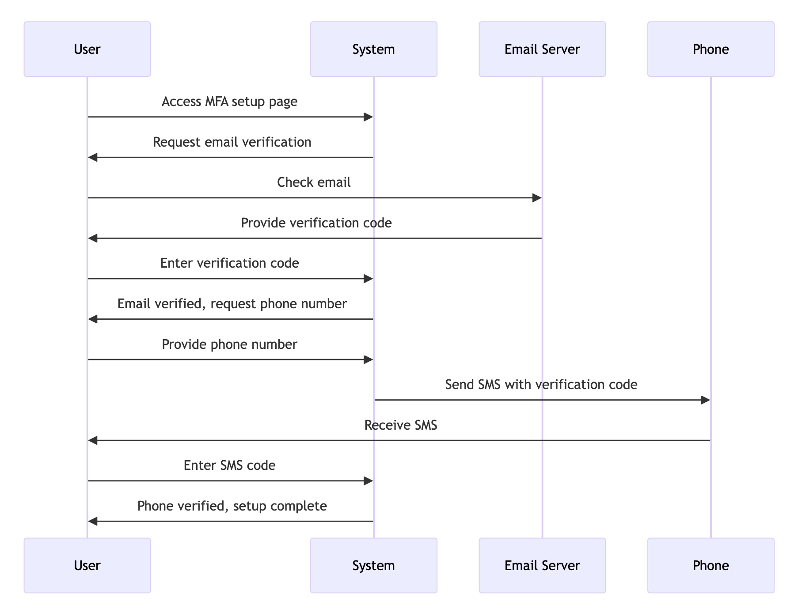

# Creating Diagrams with ChatGPT and Mermaid.live

It turns out that ChatGPT (and other large language models) are great at generating diagrams as well as text.

If you ask ChatGPT to make a diagram then it might try to use Dall-e and draw one from scratch. Dall-e and other image generators aren't good at diagrams at all.
But if you ask ChatGPT right, it can generate a good editable first draft diagram.

ChatGPT has also been trained on the [Mermaid Chart](https://mermaid.js.org/) syntax. There's lots of tools that can display Mermaid charts but the quickest and easiest is [Mermaid.live](https://mermaid.live/).

## Using Mermaid syntax and Mermaid.live

1. Enter something like `mermaid diagram for a user MFA setup process` into ChatGPT. [Demo](https://chat.openai.com/share/06a0d00a-56a0-4c52-abe4-d8ba89504282)
2. Copy the code it generates
3. Paste it into [Mermaid.live](https://mermaid.live/). [Demo](https://mermaid.live/edit#pako:eNp1UkFuwjAQ_Iq15xRB0sTgQyXUpjekqBGXKhfXWcAqsVPboaWIv9dOQAJBc7J2Z2ZnJ3sAoWsEBha_OlQCXyRfG95Uiviv5cZJIVuuHFkSbsnSorltlaFV7q3DO7w8NPOGyy0p0ezu8YsAKTZaYaWG7vLh6alkZC4EWksWr3Ni0XWtZ61xQJQesWTkLdi2jmA_wKvLlRTcSX0hlDPyvEHxOYCGej7QC6N3ssYrIgmJXNnIlUPzH-ZkJL8wgHVEzMlYG9Yiqms-zpufRM-jbwFBsWA-LVWTclGSb-k2_00vzjEIlDsM8DvOg8iN4T7vC8NDwEI37Radh0IEDRq_Ve2v4xCoFbgNNlgB888aV7zbugoqdfRQ3jld7pUA5kyHEXRtzd35mICt-Nb6qv_bwA7wAyymyYgm8WxKx5N4msaPaQT7UJ6NkllMU5plGaWT6TGCX629wniU0emMjh_TbBInSRpHgLV02iyG--3PuJ_w3uODjeMfY0Tp7A)
4. Edit it in Mermaid.live. Change themes, download or export

Here's the code it makes:

```
sequenceDiagram
    participant U as User
    participant S as System
    participant E as Email Server
    participant P as Phone

    U->>S: Access MFA setup page
    S->>U: Request email verification
    U->>E: Check email
    E->>U: Provide verification code
    U->>S: Enter verification code
    S->>U: Email verified, request phone number
    U->>S: Provide phone number
    S->>P: Send SMS with verification code
    P->>U: Receive SMS
    U->>S: Enter SMS code
    S->>U: Phone verified, setup complete
```

## Mermaid supports

- Flowchart
- Sequence Diagram
- Class Diagram
- State Diagram
- Entity Relationship Diagram
- User Journey
- Gantt
- Pie Chart
- Quadrant Chart
- Requirement Diagram
- Gitgraph (Git) Diagram
- C4 Diagram
- Mindmaps
- Timeline
- Sankey
- XYChart
- Block Diagram


## Examples

### Sequence diagram

[`mermaid diagram for a user MFA setup process`](https://chat.openai.com/share/06a0d00a-56a0-4c52-abe4-d8ba89504282) [Chart](https://mermaid.live/edit#pako:eNp1UkFuwjAQ_Iq15xQREwj1AQm16Q0pasSlysV1FrBK7NR2aCni77UTkEBATtbuzOzsZA8gdIXAwOJ3i0rgq-Rrw-tSEf813DgpZMOVI0vCLVlaNLetIrSKvXV4h5eFZlZzuSUFmt09fh4g-UYrLFXfXT7NZgUjcyHQWrJ4mxOLrm08a409ovCIJSPvwbZ1BLsBXl2upOBO6guhjJGXDYqvHtTXs56eG72TFV4RSUjkykamHJpHmJOR7MIAVhExJ2NNWIuotv48b34SPY--BQTFnPm0VEWKRUF-pNs8mp6fYxAodxjgd5wHkRvDXd4XhvuAha6bLToPhQhqNH6ryl_HIVBLcBussQTmnxWueLt1JZTq6KG8dbrYKwHMmRYjaJuKu_MxAVvxrfVV_7eBHeAXWDIaTNLhZEJpOo6n8XAUwR5YPB0P6HBKn9N44us0To4R_GntFeLBeEqTZ5qkwzSJaUojwEo6bRb9_XZn3E346PDBxvEfV9rpxA)




### Flow chart

[`mermaid flowcahrt for an ecommerce refund process`](https://chat.openai.com/share/50ea95ff-9d38-47cb-8bd5-64fbd5877a89) [Chart](https://mermaid.live/edit#pako:eNp1U91v0zAQ_1csP2dVk6Zploch1myjIMY0JiFo9mDiS2vR2MEfdCXq_84lTqYWhJ9O5_t93J3d0lJxoBmtdmpfbpm25CkvJMHzdr10xqoaNHmEnw6MNRhUTvJncnFxRa7blSF2C0T7W7IXdivkkLJOS8xIrvZvjp7wGmHkK5gevWy_MA9vtOKutISzmm2AE6WJVJbgLQdTavEd-BnDveoJVmtvhuQgBfCMfHKWqOpc-tnjlqfK-XolhRXMwtAOedCqBGNOiweRm39cOukMmmQIw16VFhsh2Y40rPzBMNyMVm_OJE9yA_P7v-0_jALGz0CD5wQ--Mp73G27VLISun51pKEE0dhB97bTeOxSv5CnQ9yth_7G7Z0U3uOgz4rf_c9WtxI_2ldDdz3iw4hYGeM6BHKK6kDGx4PFNKAY1ExwfGhtBy4ozrSGgmYYcqiY29mCFvKIpcxZ9fkgS5pZ7SCgruG4q1ywjWY1zSq2M5htmKRZS19oFs8myWKaJFG0mIdpOJ0F9ECzMJ1PomkaXS7CBPNRGB8D-lspZAgn8zSKL6M4TWdpPE-SMKDAhVX6o_8L_ZfoJb71gM7H8Q8c_gBz)


### Gantt chart

[`mermaid gantt chart for web app project: start today, 5 fortnightly sprints, milestone at the end`](https://chat.openai.com/share/6c95d0ec-a104-4655-a2da-0034221f41b2) [Chart](https://mermaid.live/edit#pako:eNp1ksFugzAMhl8l8jlUJIQWuE1CvSFN62HaxCVr3DYSJAhCt67quy9At7FV9cly_u93ZPsMW6sQMthL41xpiA8lHa5tW0tHyIuPoCiCPJ_enHYVkime8Y08NA3J8YiVbWo0jmy2B1R9haWZ9B1unbaGPFbSGG32U3XTtNqLGfmNTFmDdGyPHaOEh1wEoQj4khIm1B-OzznpGxwH0nOcErlz2F49_nPRnPvJvDaacfyWE_c4MeOiWy6-x8UzTly5v_MqdIWd8yOZymttZEWe8Kjx_duw9pKZj_dk3gYo1Oh3p5Vf6nmgS3AHrLGEzKcKd7KvXAmluXip7J3dnMwWMtf2SKFvhuXnWu5bWUO2k1Xnq400kJ3hA7I0XKSJYDEXIoyTJYUTZJyli5ClUSSWcbJKeXqh8Gmtx9lCpKngbNhlkrBVvKKASjvbFtPRjbc3-r-OwPCJyxc6ELiW)


## My old approach: Using ChatGPT and Python

For completeness, [ChatGPT's code interpreter can run Python](https://medium.com/@dave1010/exploring-chatgpt-code-interpreter-5d0872d67058).
This includes access to various Python charting libraries like:

- Matplotlib
- Graphviz
- Pydot
- NetworkX
- Plotly
- Bokeh
- Seaborn

These work fairly well, as ChatGPT is trained on writing Pytnon code to generate these. Graphviz is especially good, as it works with the DOT language, which ChatGPT is trained on.

I generally find these more clunky to edit and iterate on with ChatGPT.


